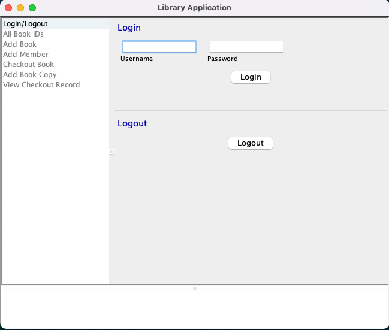
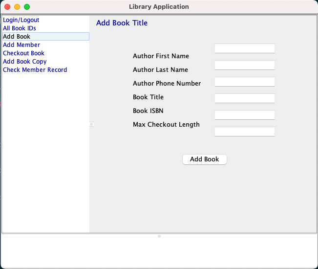
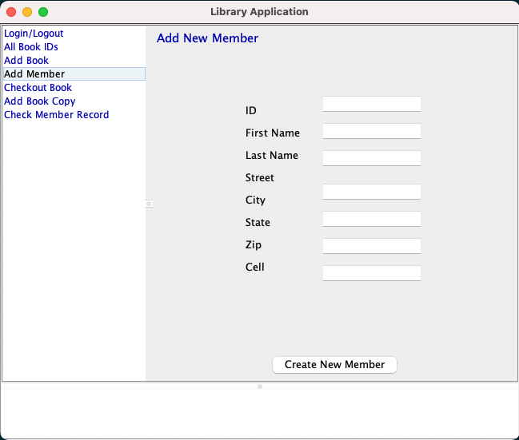
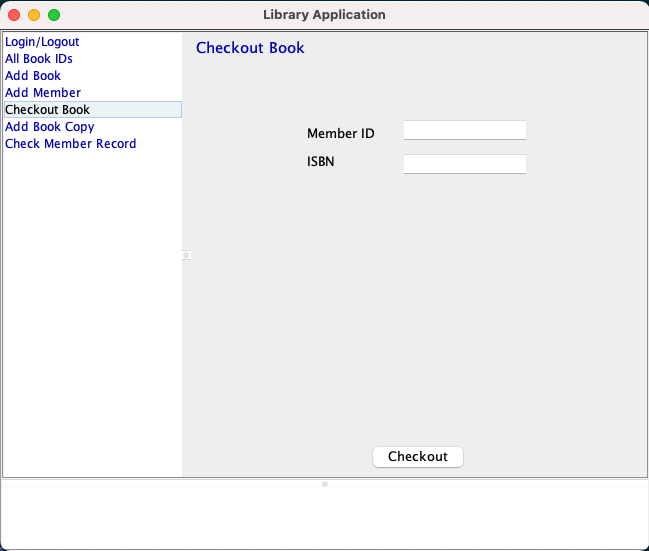
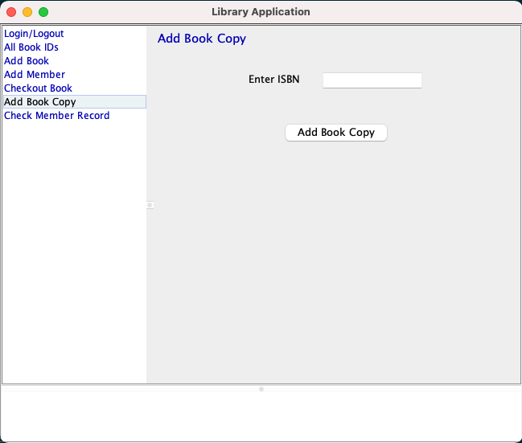
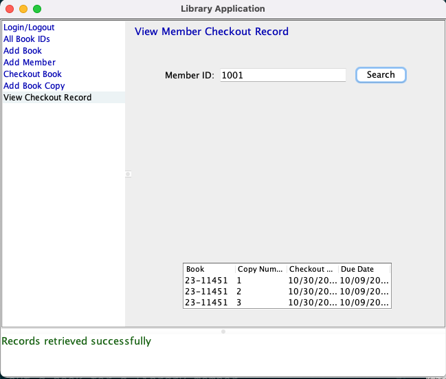

Library System
--------------

### Description
A system that a librarian can use to check out books for library members, 
and that an administrator can use to add new books to the collection, 
create new library members, and add copies of an existing book.

### How to Run the Library System Application
NOTE: This assumes final_project zipped folder is extracted and imported in Eclipse or IntelliJ IDEA

Run the file named `Main.java` located inside the src directory to launch the Library System Application.

NOTE: Running the Library System Application on a Windows PC 
In the `DataAccessFacade.java` Located in `dataaccess` package, set the `OUTPUT_DIR` as below. line 23 

    public static final String OUTPUT_DIR = System.getProperty("user.dir") + "\\src\\dataaccess\\storage";

In the `LandingPanel.java` located in `librarysystem.panels` package, `pathToImage` as below. line 36

    pathToImage = currDirectory + "\\src\\librarysystem\\library.png";
Now Run `Main.java` to launch the Application on a Windows PC

### Accepted User Roles
1. ADMIN: Can add new library member, a new book, book copies and view all book ISBN.
2. LIBRARIAN: Can check out a book for a library member, view all book ISBN.
3. BOTH: Can do all the above specified roles.

NOTE: To login to the library system, use the details specified in the [app_info](/docs/app_info)

### Features
#### Login/Logout 
    This feature enables you to Log into the system 
    Click the Login/Logout list item on the left navigation panel

#### Add a Book
    This feature adds a book to the Library

#### Add Member
    This feature adds a new library member

#### Check out Book
    This feature helps the Librarian to check out a book for a library member.

#### Add Book copy
    This feature helps the admin to add copies for an available book

#### Check Member Record
    This feature helps the librarian to view a member record

 

